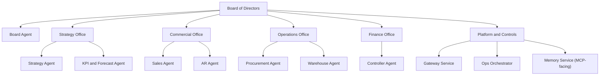

# Organization Charter (FU-01 Output)

This document defines Zavora ERP's organizational identity and strategic direction.

## Vision

Build the default autonomous operating system for modern businesses, where AI agents run operations with auditable governance and financial truth.

## Mission

Enable a business to execute strategy-to-cash with agents that negotiate, fulfill, account, report, and learn continuously under policy and board oversight.

## Values

1. Accountability by evidence: Every material action must be provable.
2. Autonomy with limits: Agents act independently within explicit mandates.
3. Financial integrity first: Economic truth is deterministic and auditable.
4. Governance over improvisation: Policy and constitutional controls are enforceable.
5. Continuous learning: Agent performance improves through semantic memory and measured outcomes.

## Organization Model

Zavora operates as a virtual company with human governance and agent execution.

## Strategic Outputs Required by FU-01

1. Business model and offering definition.
2. KPI target register and forecasting model.
3. Variance thresholds and corrective-action triggers.
4. Organization charter (`organization.md`) with vision, mission, values, and org chart.
5. Agent identity registry (`agents.md`) with mandates, limits, and escalation paths.

## Governance Binding

The organization charter and agent identity registry are controlled artifacts. Any change to mandates, values, or authority must be approved by board governance policy and recorded as evidence.
