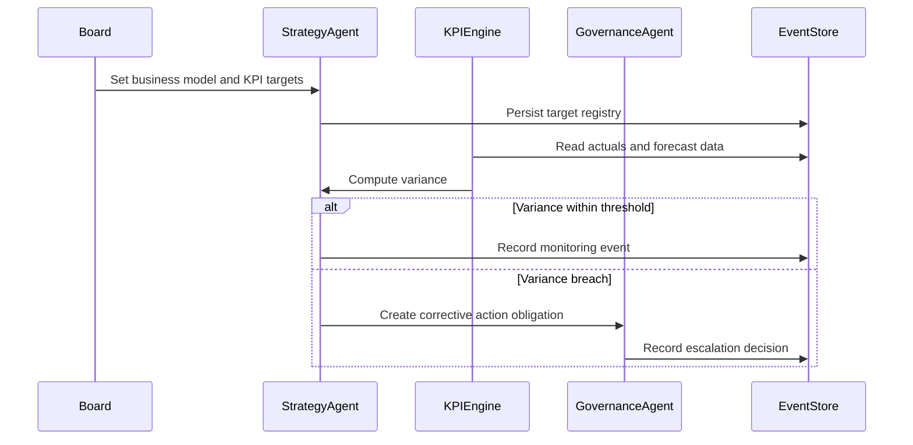
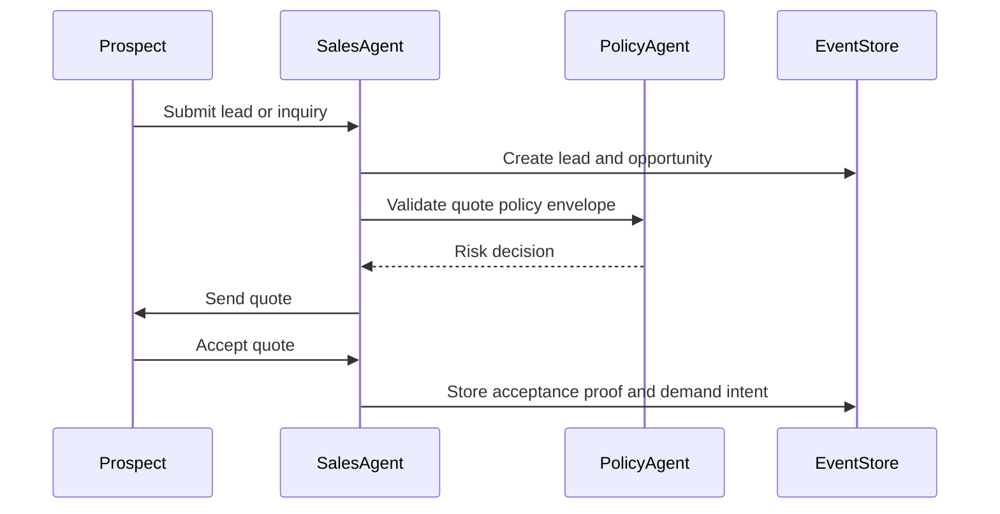
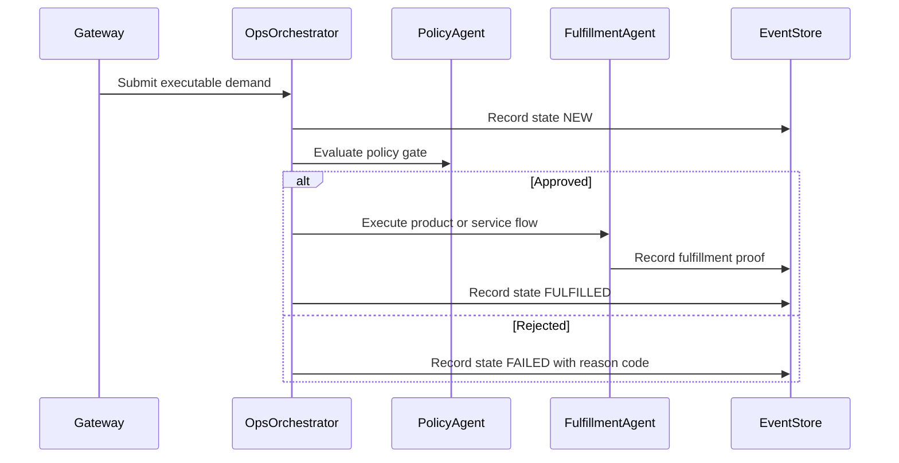
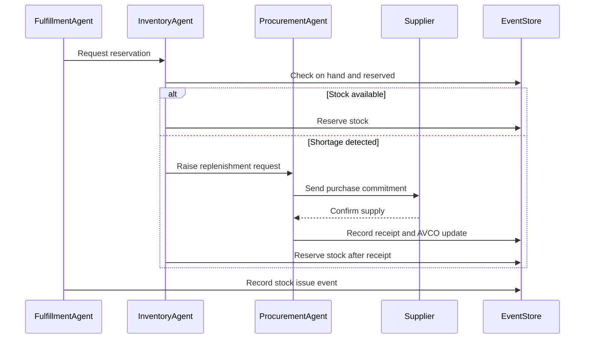
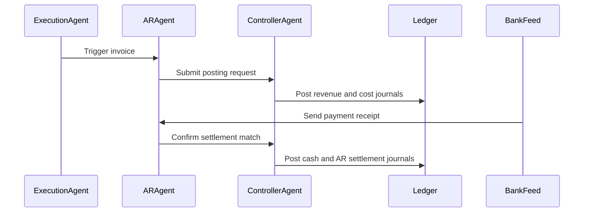
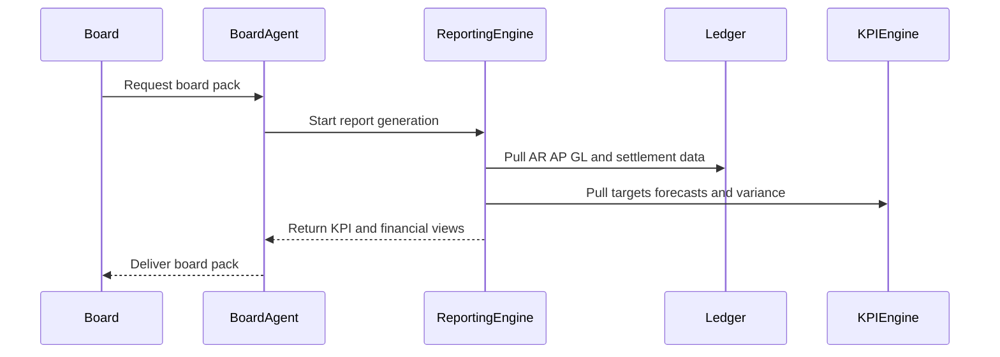
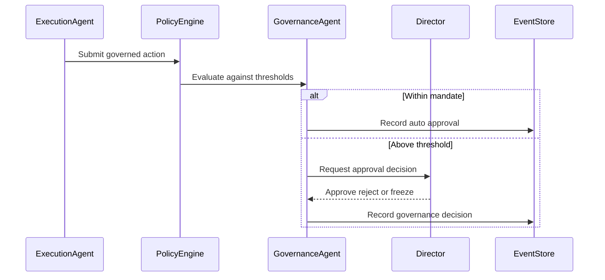
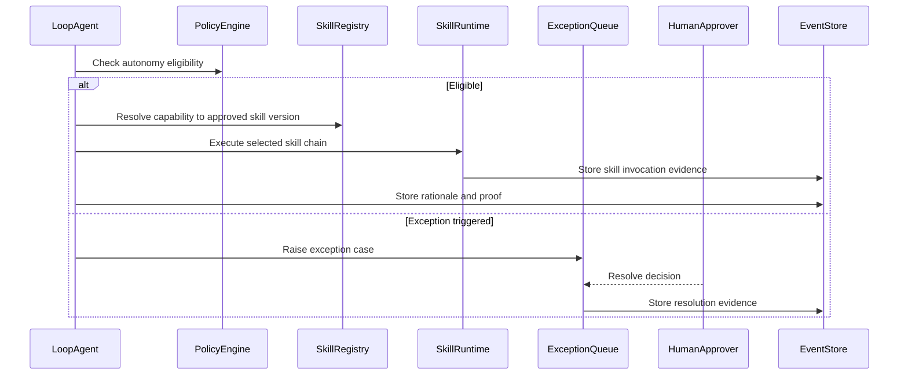
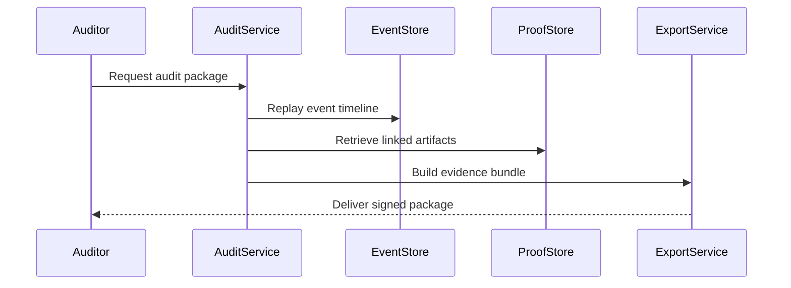
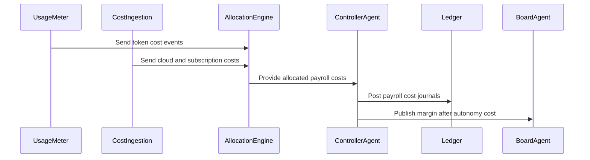

# Sequence Diagrams and User Journeys (Official)

This document defines review-ready user journeys and sequence diagrams for each major functional unit (`FU-01` to `FU-10`).

## FU-01 Strategy-to-Execution Layer

User journey:
1. Board defines business model and KPI targets for the period.
2. Strategy agent records targets and forecast baselines.
3. Variance engine compares actuals vs targets continuously.
4. If variance crosses threshold, corrective action is opened automatically.
5. Governance is notified for high-severity variance.

## FU-02 Business Origination

User journey:
1. Prospect submits inquiry through a channel.
2. Sales agent creates lead and qualifies opportunity.
3. Sales agent issues quote with policy metadata.
4. Customer accepts quote and acceptance proof is captured.
5. System converts acceptance into executable demand intent.

## FU-03 Order Processing

User journey:
1. Accepted demand is received as an executable order.
2. Orchestrator validates payload for product or service transaction type.
3. Policy gate checks mandate and risk.
4. Fulfillment path runs and order state transitions to close.
5. On failure, reason codes and exception outcome are persisted.

## FU-04 Inventory and Procurement (Product Flows)

User journey:
1. Product order requests stock reservation.
2. Inventory agent checks available quantity.
3. If shortage exists, procurement agent creates supplier commitment.
4. Supplier receipt updates inventory and AVCO valuation.
5. Product issue updates stock and COGS basis.

## FU-05 Finance and Accounting

User journey:
1. Completed execution triggers invoice creation.
2. Controller posts balanced journals for revenue and cost.
3. AR or AP lifecycle is tracked through settlement.
4. Payment receipts are matched and settlement is confirmed.
5. Service and product costs are both recognized under policy.

## FU-06 Reporting and Revenue Tracking

User journey:
1. Board requests reporting pack for current period.
2. Reporting engine aggregates operational and financial projections.
3. Revenue states are computed as booked, billed, and collected.
4. Variance and trend views are generated.
5. Board receives decision-ready pack.

## FU-07 Governance and Policy Enforcement

User journey:
1. An action is proposed by an execution agent.
2. Policy engine checks thresholds and mandate.
3. If above threshold, action is escalated to authorized human approver.
4. Approver decides approve, reject, or freeze.
5. Decision is recorded and enforced across workflows.

## FU-08 Agent Autonomy and Exception Handling

User journey:
1. Agent loop picks next eligible work item.
2. Agent resolves required capabilities to approved skills and versions.
3. Agent executes autonomously within mandate through selected skills.
4. If exception is triggered, workflow is routed to human queue.
5. Resolved exception returns control to autonomous loop with rationale persisted.

## FU-09 Audit and Compliance Evidence

User journey:
1. Auditor requests evidence for transaction or period.
2. Audit service replays timeline from immutable events.
3. Linked commitment, obligation, proof, and settlement artifacts are assembled.
4. Evidence package is generated and signed.
5. Auditor reviews reproducible package.

## FU-10 Agent Payroll and Cost Allocation

User journey:
1. Usage meter captures token consumption by agent action.
2. Cloud and subscription costs are ingested by period.
3. Allocation engine assigns costs to workflow, order, and period.
4. Controller posts payroll-cost journals and reconciles totals.
5. Board receives margin-after-autonomy-cost reporting.

## Cross-Functional Review Checklist

1. Verify each journey preserves constitutional objects (`commitment`, `obligation`, `proof`, `settlement`).
2. Verify each sequence has a policy gate and exception handling path where applicable.
3. Verify product and service execution paths are both represented.
4. Verify each diagram can be mapped to `FR-*`, `NFR-*`, `DS-*`, and `TSK-*`.
